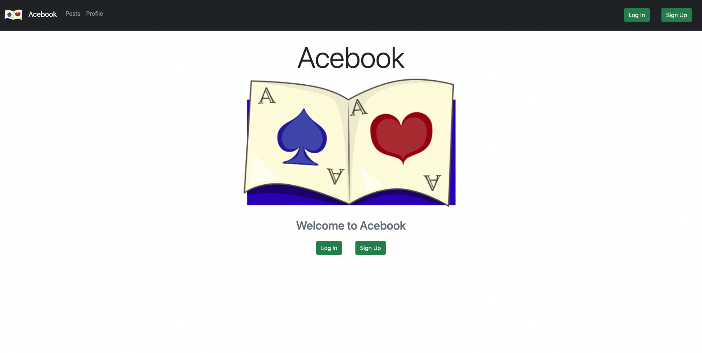
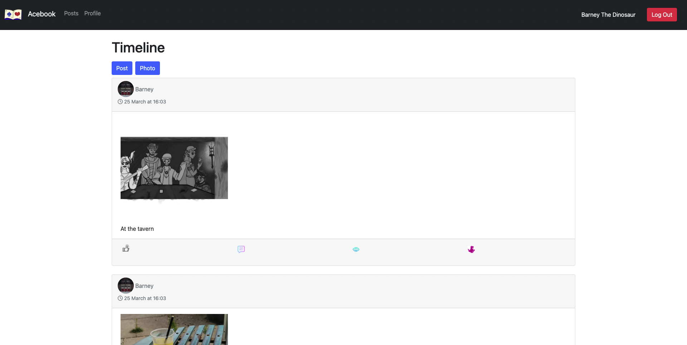
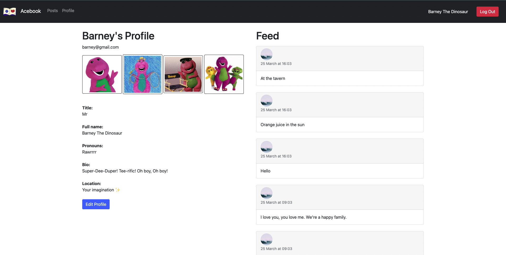

# Acebook
[Presentation ](https://docs.google.com/presentation/d/126CHpomnPGjHETNXBd1pXQgrdIJa2hRLT_8i_uSOU4I/edit?usp=sharing)| [ Project Board ](https://trello.com/b/i0GzPkoZ/acebook-board-super-awesome-cool-dynamite-wolf-squadron)

## Tech Stack

- [Express](https://expressjs.com/) web framework for Node.js.
- [Nodemon](https://nodemon.io/) to reload the server automatically.
- [Handlebars](https://handlebarsjs.com/) to render view templates.
- [Mongoose](https://mongoosejs.com) to model objects in MongoDB.
- [ESLint](https://eslint.org) for linting.
- [Jest](https://jestjs.io/) for testing.
- [Cypress](https://www.cypress.io/) for end-to-end testing.
- [Bootstrap](https://getbootstrap.com/) for template rendering of HTML and CSS.

<br>

------
<br>


## MVP
- Sign up: validation
- Log in: validation
- Log out: end the session
- Show posts in reverse chronological order
- I want to see a users name/photo next to each post
- I want to be able to comment on a post

<br>

------
<br>


## MVP User stories
```
As a User
So that I can have my own personalised profile
I want to be able to sign up

As a User
So that I can retrieve my profile
I can log in

As a User
So that I can keep my profile secure
I can log out

As a User
So that I keep up to date with my friend's latest posts 
They should be displayed in reverse chronological order

As a User
So I can clarify who I'm talking to
I want to see a user's name and photo with their posts

As a User
So that I socialise with my friends
I want to comment on posts 
```

<br>

------
<br>


## Additional user stories
```
As a User
So that people can know more about me
I want to be able to create a profile

As a User
So that I visually share my life with my followers
I want to be able to post photos

As a User
So that I can get around the site easily
I want to see a nav bar at the top of every page

As a User
So that I can show my appreciation on a post
I want to be able to like a post and see all the likes

As a User
So that I can see my past posts and profile
I want to be able to visit my profile

As a User
So that I can use the website
I want to access the site from a Heroku link
```
<br>

------
<br>

## Credits

Credit to Bromley and his team for some code we re-used (with permission) within the /cypress/plugins/index.js and /cypress/support/index.js to enable auto clearing of test databases (code taken from <a href="https://github.com/nyahehnagi/acebook-makerverse">here </a>)

<br>

------
<br>

## Screenshots of the website
### Homepage:


### Feed:


### Profile page:


<br>

------
<br>

## Quickstart

### Install Node.js

1. Install Node Version Manager (NVM)
   ```
   brew install nvm
   ```
   Then follow the instructions to update your `~/.bash_profile`.
2. Open a new terminal
3. Install the latest long term support (LTS) version of [Node.js](https://nodejs.org/en/), currently `16.14.0`.
   ```
   nvm install 16
   ```

### Set up

1. Install Node.js dependencies
   ```
   npm install
   ```
2. Install an ESLint plugin for your editor. For example: [linter-eslint](https://github.com/AtomLinter/linter-eslint) for Atom.
3. Install MongoDB
   ```
   brew tap mongodb/brew
   brew install mongodb-community@4.4
   ```
4. Start MongoDB
   ```
   brew services start mongodb-community@4.4
   ```

### Start

1. Start the server
   ```
   npm start
   ```
2. Browse to [http://localhost:3000](http://localhost:3000)

### Test

- Run all tests
  ```
  npm test
  ```
- Run a check
  ```bash
  npm run lint              # linter only
  npm run test:unit         # unit tests only
  npm run test:integration  # integration tests only
  ```

#### Start test server

The server must be running locally with test configuration for the
integration tests to pass.

```
npm run start:test
```

This starts the server on port `3030` and uses the `acebook_test` MongoDB database,
so that integration tests do not interact with the development server.
